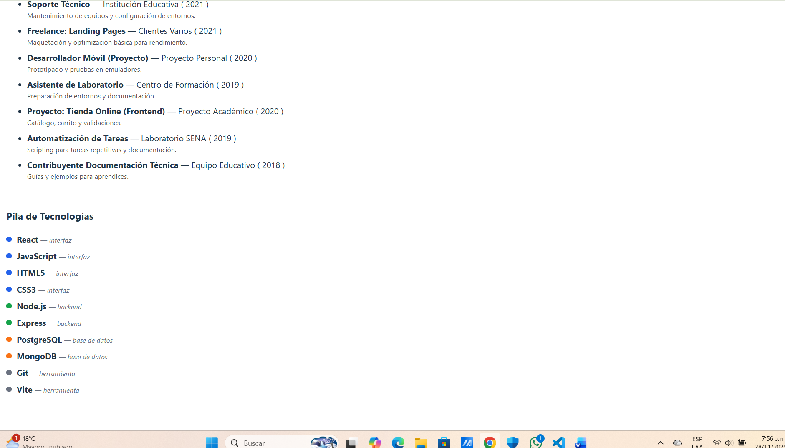

# cv-react-v06

## Proyecto
CV dinámico en React (Vite)

## Descripción
Pequeña aplicación de CV que usa renderizado de listas y condicional para mostrar:
- Experiencia profesional (array dinámico con 10 entradas)
- Educación (lista dinámica)
- Stack de tecnologías (renderizado condicional por tipo con colores)

## Instrucciones
1. Instalar dependencias:
   ```bash
   npm install
   ```
2. Ejecutar en modo desarrollo:
   ```bash
   npm run dev
   ```
3. Abrir la URL que muestra Vite (ej: http://localhost:5173)

## Commits sugeridos
- feat: componente Experiencia dinamico con 10 cargos definidos
- feat: componente Educacion dinamico con formación complementaria
- feat: feat: componente StackTecnologias dinamico y con renderizado condicional
- docs: actualizar README con instrucciones

## Captura
