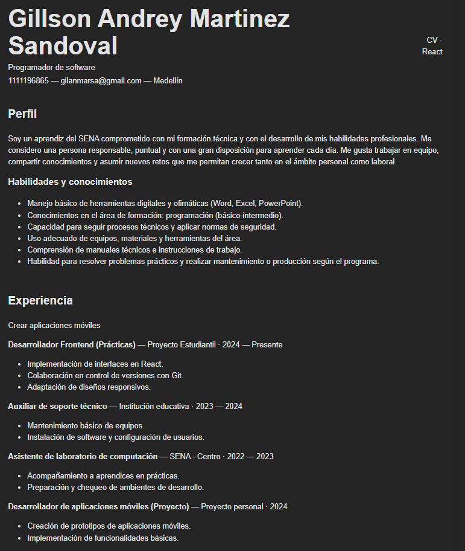

# cv-react-gillson

## Nombre del proyecto
CV modular en React (Vite) — Gillson Andrey Martinez Sandoval

## Captura de pantalla


## Descripción
Hoja de vida modular implementada en React utilizando componentes funcionales anidados. Cada sección (Cabecera, Perfil, Experiencia, Educación) está en su propio componente y se integran desde `App.jsx`.

## Requisitos
- Node.js (LTS recomendado)
- npm
- Git

## Instalación y ejecución
```bash
git clone https://github.com/TU_USUARIO/cv-react-gillson.git
cd cv-react-gillson
npm install
npm run dev
Luego abrir http://localhost:5173 (u otra URL que muestre Vite).

Commits
Todos los commits reflejan la creación de cada componente:

feat: componente CabeceraCV con datos personales actualizados

feat: componente Perfil con descripción personalizada

feat: componente Experiencia con 4 cargos definidos

feat: componente Educacion con formación complementaria

chore: integrar componentes en App y añadir estilos básicos